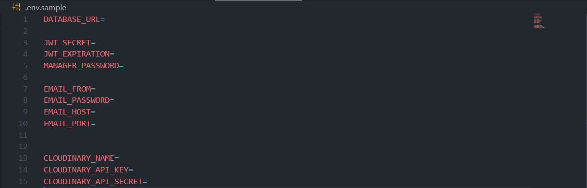

# Shoes-api
---
### Version: v1
---
## Technical Requirements
* PostgreSQL
  - Kysely / Drizzle
  - Prisma
* NestJS
* TypeScript
* Prettier
* ESLint

## Mandatory Features
1. **Authentication endpoints** (sign up, sign in, sign out, forgot, reset password)
2. **List products** with pagination
3. **Search products** by category
4. Add 2 kinds of users (Manager, Client)
5. As a **Manager** I can:
   - ✅Create products
   - ✅Update products
   - ✅Delete products
   - ✅Disable products
   - ✅Show clients' orders
   - ✅Upload images per product
6. As a **Client** I can:
   - ✅See products
   - ✅See the product details
   - ✅Buy products
   - ✅Add products to cart
   - ✅Like products
   - ✅Show my order
7. ✅The product information (including images) should be visible to both logged-in and not logged-in users
8. **Stripe Integration** ✅for payment (including webhook management)

## Mandatory Implementations
- ✅Schema validation for environment variables
- ✅Usage of global exception filter
- ✅Usage of guards, pipes (validation)
- ✅Usage of custom decorators
- ✅Configure helmet, CORS, rate limiting (for reset password feature)

## Extra Points
* ⚰️Implement resolve field in GraphQL queries (if applicable)
* ⚰️When the stock of a product reaches 3, notify the last user who liked it but hasn't purchased it yet with an email, including the product's image. Use a background job for this task.
* ✅Send an email when the user changes their password
* ⚰️Deploy on Heroku

## Notes: 

**Requirements to use REST**: 
- Authentication endpoints (sign up, sign in, sign out, forgot, reset password)
- Stripe Integration for payment (including webhook management)

**Requirements to use GraphQL**: 
- All features not listed under the REST requirements

--------

## Description

Shoes-API is a **full-stack educational project** designed to demonstrate modern technologies, best practices, and design patterns in software development. It showcases a complete workflow from backend to frontend, using industry-standard tools and frameworks.

## Technologies Used

| Technology     | Purpose                                          | Image                                     |
| -------------- | ------------------------------------------------ | ----------------------------------------- |
| **Prisma**     | For database access and ORM.                     |  |
| **GraphQL**    | For efficient API queries and data manipulation. |  |
| **Swagger**    | For API documentation and testing.               |  |
| **NestJS**     | Backend framework for scalable applications.     |  |
| **PostgreSQL** | Database for storing application data.           |  |
| **Express**    | For building fast and minimal web applications.  |  |
| **Node**       | JavaScript runtime for server-side development.  |  |
| **TypeScript** | For static typing and enhanced JavaScript.       |  |

## Getting Started

### Prerequisites

Ensure you have the following installed:

- **Node.js** (v14 or later)
- **npm** (Node Package Manager) or **yarn**
- **PostgreSQL** (Database OR use docker) 

### Installation

1. **Clone the repository**:
   ```bash
   git clone <code that you copied from the repositorie>

## Configuration

### Environment Variables
In this part, you need to add your environment variables that will be used for the API.




- **Cloudinary**: 
  You will need a Cloudinary account to get your own credentials. Paste them into the `.env` file and remove the `.sample` provided.

- define the `JWT_SECRET` = `261bb2f1d8161e6ae1b9c49045f1ecc9c5890cf6f098266e17bb9fba76b813402cc170100a017ca54e8dbc973b2303e75fd6ae14d3af482f893c73c866b5c87ada2912ee165054463f51462f8688c3e1b27060c8027a850315d945290fa6f08eb4953bd55b2bd67819c88ab9500fd685dd90f11e7f54a33d5adb8a252fe1f923e59d984b8a26bec148ad9bad237252538fb08644f7c057c46087e7081ec5a66bd9131b784ffaad0d74fdd68fed539d2dd41002a4417efc587d2dd431ca714b7728516dce3e7f18ef24833ecd847ec7d5c45e2cb9f0608d600987b0ec742fdf36`  AND JWT `EXPIRATION` = `14400` fields

- **Database Configuration (using Docker)**: 
  If you are using Docker, follow these steps to properly configure your PostgreSQL database.

### Docker Setup

1. Create a `docker-compose.yml` file with the following content:

```yaml
version: '3.8'

services:
  postgres_container:
    image: postgres:17
    container_name: postgres_container
    environment:
      POSTGRES_USER: postgres
      POSTGRES_PASSWORD: postgres
      POSTGRES_DB: test_db
    networks:
      - my_network
    ports:
      - "5432:5432"

  pgadmin4_container:
    image: dpage/pgadmin4
    container_name: pgadmin4_container
    environment:
      PGADMIN_DEFAULT_EMAIL: admin@admin.com
      PGADMIN_DEFAULT_PASSWORD: admin
    networks:
      - my_network
    ports:
      - "5050:80" # Or your preference

networks:
  my_network:
    driver: bridge
```

2. After creating the `docker-compose.yml` file, run the following command to bring up the Docker containers:

```bash
docker-compose up
```

This will create the PostgreSQL and pgAdmin containers.

3. Find your PostgreSQL container's IP address using:

```bash
docker inspect postgres_container
```

Look for the `"IPAddress": "your_corresponding_IP"` and note it down.

4. Configure your server to connect to the PostgreSQL instance using the IP address you retrieved.

---

### Running the Project

1. **Install Dependencies**:
   Open your IDE and run the following command to install all the necessary dependencies:

   ```bash
   npm i
   ```

2. **Generate Prisma Client**:
   Next, generate the Prisma client by running:

   ```bash
   npx prisma generate
   ```

3. **Seed Database**:
   Finally, seed the database with sample data by running:

   ```bash
   npm run seeds
   ```


## License

This project is licensed under the MIT License. See the [LICENSE](LICENSE) file for details.